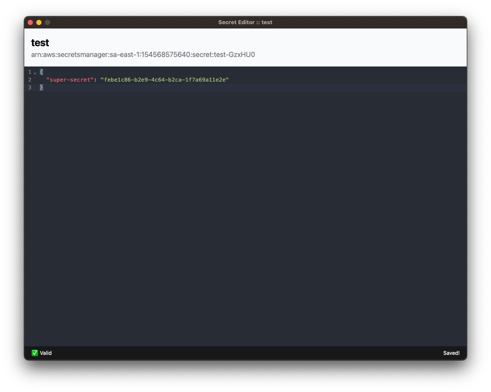

<div align="center">
<a href="https://github.com/valtlfelipe/secret-editor"></a>
</div>

<h1 align="center">Secret Editor</h1>

<div align="center">

[](https://github.com/valtlfelipe/secret-editor/blob/main/LICENSE)
[](https://github.com/valtlfelipe/secret-editor/releases)


<strong>Secret Editor is a modern lightweight cross-platform AWS Secrets Manager editor desktop app available for Mac, Windows, and Linux.</strong>



</div>

## Features

- Create a new blank Secret
- List and open available secrets on the current AWS account
- Edit & Save JSON secrets with syntax validation
- Lightweight, built on Webview2, without embedded browsers (Thanks to [Wails](https://github.com/wailsapp/wails)).
- Visually and user-friendly UI (Thanks to [shadcn vue](https://github.com/radix-vue/shadcn-vue) and [codemirror](https://github.com/codemirror/dev)).

## Installation

Available to download for free from [here](https://github.com/valtlfelipe/secret-editor/releases).

### Setup AWS credentials

Currently it's required to have AWS credentials setup in your home path, same as for the AWS cli ([more info here](https://docs.aws.amazon.com/cli/v1/userguide/cli-configure-files.html)).

The `default` profile will be used, and those are the minimum IAM requirements:

```json
[
  "secretsmanager:CreateSecret",
  "secretsmanager:DescribeSecret",
  "secretsmanager:GetSecretValue",
  "secretsmanager:ListSecretVersionIds",
  "secretsmanager:ListSecrets",
  "secretsmanager:PutSecretValue",
  "secretsmanager:UpdateSecret"
]
```

## Development

Prerequisites:

- Go (latest version)
- Node.js >= 20 & NPM
- [Wails](https://wails.io/)

To run in live development mode, run `wails dev` in the project directory. This will run a Vite development
server that will provide very fast hot reload of your frontend changes. If you want to develop in a browser
and have access to your Go methods, there is also a dev server that runs on http://localhost:34115. Connect
to this in your browser, and you can call your Go code from devtools.

## Building

To build a redistributable, production mode package, use `wails build`.

# TODO

- [x] Before open or create warning
- [ ] Before close warning
- [ ] AWS Credentials setup
- [ ] Secret out of version check
- [ ] Theme settings
- [ ] Blur secret when out of focus setting

<small><a href="https://br.freepik.com/icone/escudo_13900582#fromView=search&page=1&position=2&uuid=1063755b-d282-42e9-bb45-52470b56a107">Logo icon by HideMaru</a></small>
